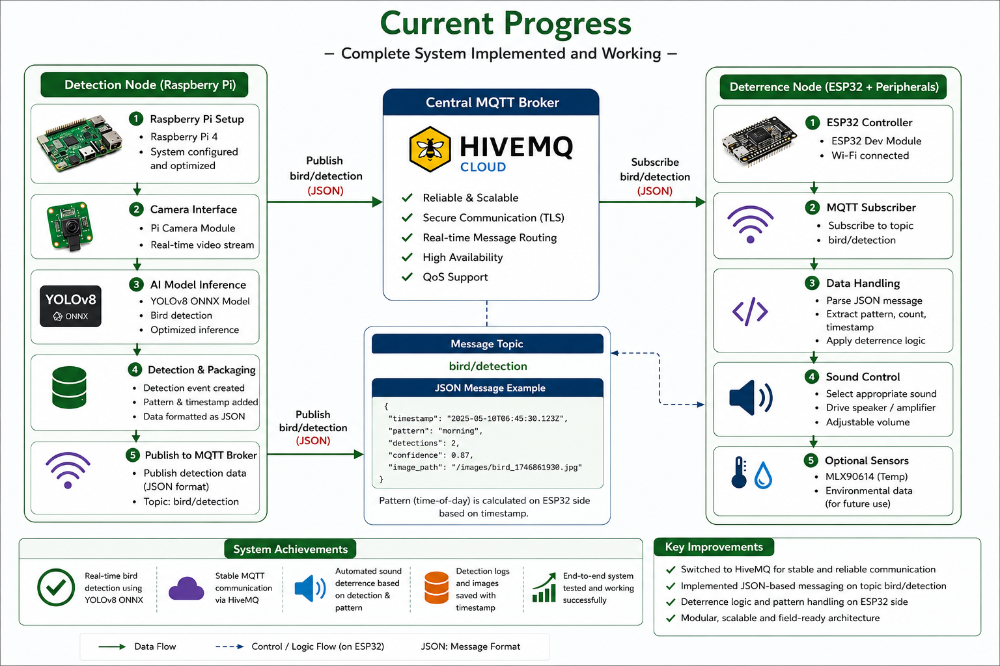

# Vision-Triggered Smart Bird Repellent System 🐦🚫🌾

An AI-powered smart agriculture solution that detects birds in real time using computer vision and automatically triggers deterrent actions to reduce crop damage.

The system uses **YOLOv8 ONNX** running on **Raspberry Pi** for bird detection and communicates with **ESP32 nodes** using **MQTT** to activate sound-based bird repellent mechanisms.

---

## 📌 Project Overview

Bird attacks on crops cause major agricultural losses and traditional deterrent methods require continuous manual intervention.

This project provides an intelligent and automated approach by combining:

- Edge AI
- Computer Vision
- IoT Communication
- Smart Deterrence Mechanisms
- Real-time Data Logging

The system only activates when birds are detected, helping reduce unnecessary power consumption.

---

## 🚀 Features

✅ Real-time bird detection using YOLOv8 ONNX  
✅ Raspberry Pi based image processing pipeline  
✅ MQTT communication between Raspberry Pi and ESP32  
✅ Automatic sound triggering system  
✅ Bird activity logging and timestamp storage  
✅ Detection image saving  
✅ Scalable architecture for multiple nodes  
✅ Low-cost smart agriculture implementation

---

## 🏗 System Architecture

### Detection Node (Raspberry Pi)

- Raspberry Pi 4
- Pi Camera Module
- YOLOv8 ONNX model
- Image processing pipeline
- MQTT publisher

### Communication Layer

- HiveMQ Cloud MQTT Broker
- JSON message transfer
- Real-time event publishing

### Deterrence Node (ESP32)

- ESP32 Development Board
- MQTT subscriber
- Speaker control system
- Pattern analysis
- Sound triggering logic

---

## 🔄 Working Flow

1. Camera continuously captures field images
2. Raspberry Pi runs YOLOv8 ONNX inference
3. Bird object is detected
4. Detection data is packaged into JSON format
5. Data is published to MQTT topic:

```text
bird/detection
```

6. ESP32 subscribes to topic
7. Detection event processed
8. Speaker system activated
9. Detection logs stored for analysis

---

## 🧰 Hardware Used

### Detection Unit
- Raspberry Pi 4
- Raspberry Pi Camera Module
- Power Supply

### Deterrence Unit
- ESP32 Dev Board
- Audio Amplifier Module
- Speaker
- Breadboard & jumper wires

---

## 💻 Software Stack

- Python
- OpenCV
- YOLOv8 ONNX
- MQTT
- HiveMQ Cloud
- ESP32 Firmware
- ESP-IDF Framework

---

## ⚠ Challenges Faced

- Local MQTT broker reliability issues on Raspberry Pi
- Connectivity challenges with ESP32 nodes
- False detections due to limited non-bird dataset samples
- Real-time optimization between AI inference and IoT communication
- Pattern-based deterrence tuning

---

## 🔮 Future Scope

- Improve detection accuracy using larger datasets
- Reduce false positives
- Add bird species classification
- Solar-powered deployment
- Mobile dashboard support
- Multiple IoT node deployment
- Remote analytics and monitoring

---

## 📷 Project Images

- System Architecture Diagram
  
- Raspberry Pi Detection Node
  
- ESP32 Deterrence Module
  

---

## 🎯 Applications

- Smart Agriculture
- Crop Protection Systems
- Edge AI Solutions
- IoT Monitoring Systems
- Automated Bird Deterrence

---

## 👨‍💻 Team

**D Mabu Jaheer Abbas**

**Narra Raghuvender**  

---

## 📄 License

This project is developed as part of the Capstone Project.

Open for educational and research purposes.
